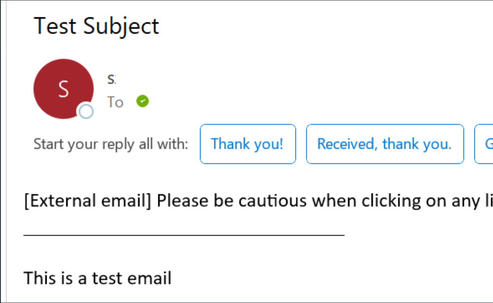

# Email Service API

API for sending emails via HTTP POST requests.

## Endpoint
- **Server:** `server-ip`
- **URL:** `/send-email`
- **Method:** POST
- **Content-Type:** application/json

## Request Body

The request body must be a JSON object with the following fields:

- **to** (array of strings, required): An array of email addresses of the recipients.
- **from** (string, required): The email address of the sender.
- **subject** (string, required): The subject of the email.
- **body** (string, required): The body of the email.

```json
{
    "to": ["recipient1@example.com", "recipient2@example.com"],
    "from": "sender@example.com",
    "subject": "Test Subject",
    "body": "This is a test email"
}
```
## Example:

```bash
curl -X POST -H "Content-Type: application/json" -d '{
    "to": ["recipient1@example.com", "recipient2@example.com"],
"from":"sender@example.com","subject":"Test Subject", "body":"This is a test email"}' http://server-ip:8080/send-email
```
